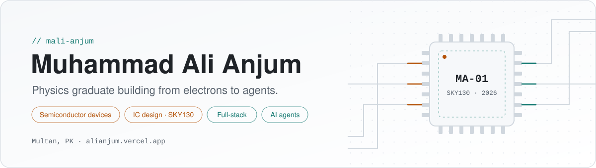
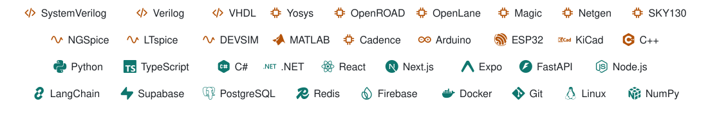
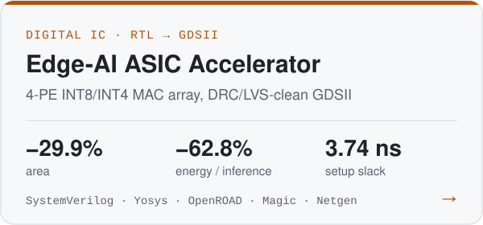
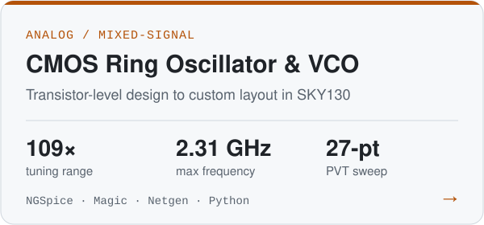
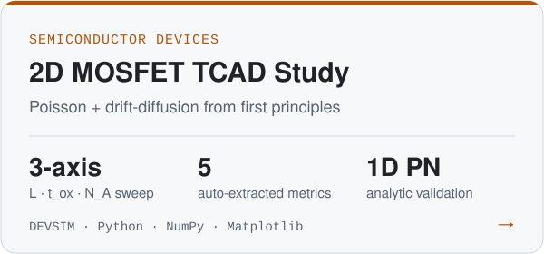
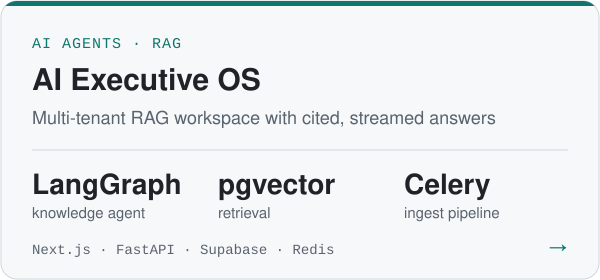
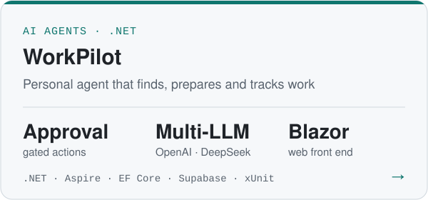
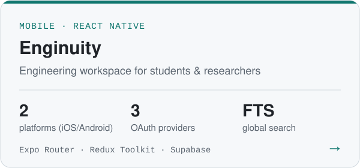
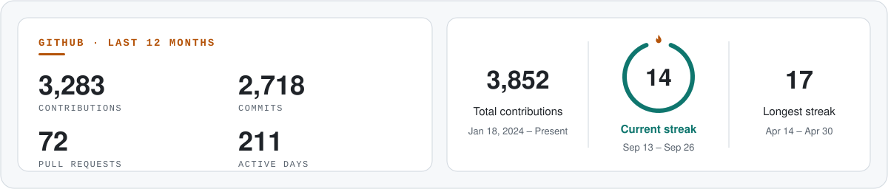

<a href="https://alianjum.vercel.app/">
  <picture>
    <source media="(prefers-color-scheme: dark)" srcset="assets/hero-dark.svg">
    
  </picture>
</a>

  <picture>
    <source media="(prefers-color-scheme: dark)" srcset="assets/typing-dark.svg">
    
  </picture>

  <a href="https://alianjum.vercel.app/"> <b>Website</b></a>
  &nbsp;&nbsp;
  <a href="https://alianjum.vercel.app/"> <b>Blog</b></a>
  &nbsp;&nbsp;
  <a href="mailto:muhammadaliabbas7890@outlook.com"> <b>Email</b></a>

 

  <picture>
    <source media="(prefers-color-scheme: dark)" srcset="assets/tech-dark.svg">
    
  </picture>

 

I'm a physics graduate (BS Physics, BZU Multan, CGPA 3.61) who works across the whole stack of modern computing. I've modelled MOSFETs from the semiconductor equations, designed oscillators at transistor level, taken an Edge-AI accelerator from RTL to signoff GDSII on SkyWater SKY130, and shipped full-stack apps and LLM agents. I'm most interested in **low-power IC design, analog/mixed-signal circuits, and AI hardware**.

## Selected work

<table>
  <tr>
    <td width="50%" valign="top">
      <a href="https://github.com/mali-anjum/low-power-edge-ai-asic-accelerator">
        <picture>
          <source media="(prefers-color-scheme: dark)" srcset="assets/card-asic-dark.svg">
          
        </picture>
      </a>
    </td>
    <td width="50%" valign="top">
      <a href="https://github.com/mali-anjum/CMOS-Ring-Oscillator-VCO">
        <picture>
          <source media="(prefers-color-scheme: dark)" srcset="assets/card-vco-dark.svg">
          
        </picture>
      </a>
    </td>
  </tr>
  <tr>
    <td width="50%" valign="top">
      <a href="https://github.com/mali-anjum/semiconductor-device-simulation">
        <picture>
          <source media="(prefers-color-scheme: dark)" srcset="assets/card-tcad-dark.svg">
          
        </picture>
      </a>
    </td>
    <td width="50%" valign="top">
      <a href="https://github.com/mali-anjum/ai-executive-os">
        <picture>
          <source media="(prefers-color-scheme: dark)" srcset="assets/card-aios-dark.svg">
          
        </picture>
      </a>
    </td>
  </tr>
  <tr>
    <td width="50%" valign="top">
      <a href="https://github.com/mali-anjum/WorkPilot">
        <picture>
          <source media="(prefers-color-scheme: dark)" srcset="assets/card-workpilot-dark.svg">
          
        </picture>
      </a>
    </td>
    <td width="50%" valign="top">
      <a href="https://github.com/mali-anjum/Enginuity-App">
        <picture>
          <source media="(prefers-color-scheme: dark)" srcset="assets/card-enginuity-dark.svg">
          
        </picture>
      </a>
    </td>
  </tr>
</table>

**Also here:** [Computational-Physics](https://github.com/mali-anjum/Computational-Physics) (C++) · [blind-75-leetcode](https://github.com/mali-anjum/blind-75-leetcode)

 

## GitHub activity

<picture>
  <source media="(prefers-color-scheme: dark)" srcset="assets/stats-dark.svg">
  
</picture>

## Beyond the terminal

- 📝 I write a technical blog and newsletter that teaches React, Node.js and full-stack skills to student developers.
- 🩸 I volunteer with the Regional Blood Group Center in Multan.
- 🏅 I received the Government of Punjab Benevolent Fund Award and Laptop Award for academic results.
- 🏃 Outside work I run, go on nature walks, read, and write poetry.

Graphics are generated by <code>scripts/build_assets.py</code>. Activity stats refresh every 6 hours via <code>scripts/github_stats.py</code>.
